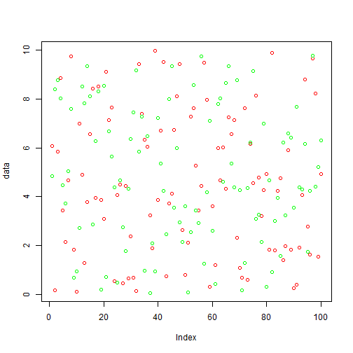

## Flu

**Flu basics**:
- Contagious respiratory illness caused by influenza viruses.
- Can cause mild to severe illness
- But some groups (people under 5 or over 65, and pregnant women) are at higher risk of complications
- Occasional appearance of more severe strains (e.g. H1N1 aka "swine flu")
- More info: http://www.cdc.gov/flu/about/disease/index.htm

--- .class #id 

## Flu Surveillance

**US Centers for Disease Control**
- Collect data about flu cases from various sources
- Early warning of outbreaks
- Lots of different data collected, but this project looks at: the U.S. Outpatient Influenza-like Illness Surveillance Network (ILINet)

**ILINet**
- Weekly reports from 1,800 outpatient healthcare providers around the country 
- Number of patients with influenza-like illness (ILI) by age group
- ILI is defined as fever (temperature of 100°F [37.8°C] or greater) and a cough and/or a sore throat without a KNOWN cause other than influenza
- More info: http://www.cdc.gov/flu/weekly/overview.htm 

--- .class #id 

## Project

**Presents ILINet data in graph form**
- Original data: http://gis.cdc.gov/grasp/fluview/fluportaldashboard.html
- 5 time series (5 age groups and a total)
- Project limited to 2009-2014 (to avoid some periods of incomplete data)
- Project code graphs this data, with options to select among the time series and smooth the data by taking a moving average over a specified number of weeks

**Look for patterns**
- Seasonal cycle?
- Relative size of outbreaks?
- Different patterns in different age groups?
- etc.

--- .class #id 
## Project results

**You might have to hit refresh to get the graph to show up here. Scroll down for controls.**

<iframe 
  src="http://jjsmartin.shinyapps.io/course_project" width="10" height="10" >
</iframe>

--- .class #id 
## Project results link

If the thing didn't display on the previous page, here's a link:

http://jjsmartin.shinyapps.io/course_project

--- .class #id 
## Some R code

And here's the results of some pointless R code:

 

--- .class #id 
## Future work? 

**Ideas**
- use proportions of the population, rather than just raw numbers
- more detailed geographic breakdown (e.g. by state)
- fit a model to each time series and make predictions
- compare to other data (e.g. how accurate is Google Flu Trends?)

